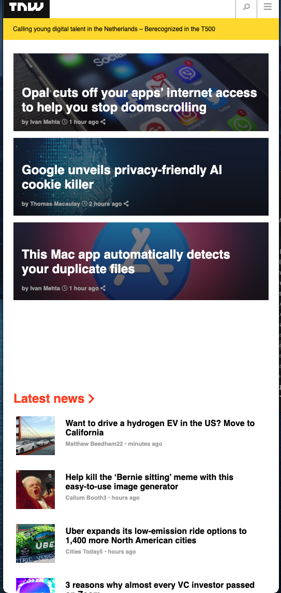
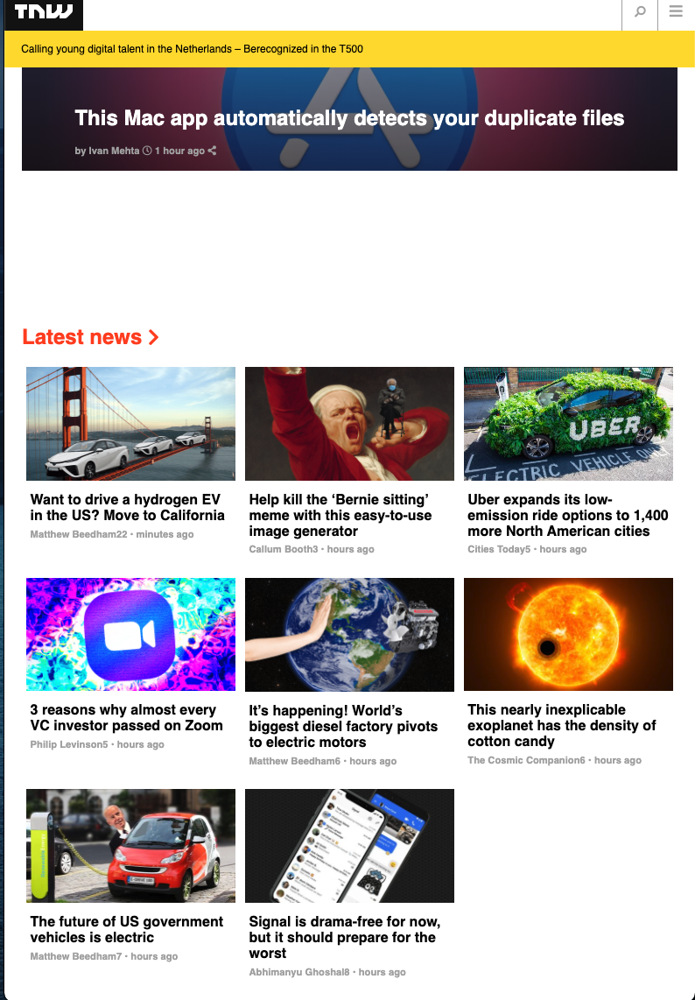
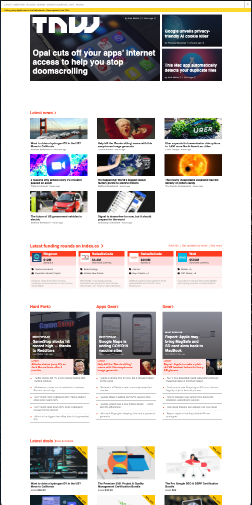

# Responsive Design

We replicate the archived version of the website The Next Web. The main goal of the project is to apply responsive design with Media queries

Additional description about the project and its features.

## Building with Responsive Design Replica of the website The Next Web

- HTML
- CSS

## Live Demo

[Live Demo Link](https://livedemo.com)

## Getting Started

In this project, we will replicate the archived version of the website The Next Web. The main goal of the project is to apply responsive design techniques so that the website behaves differently depending on the size of the screen where the website is displayed.

### Prerequisites
- Microverse Project Template
- Lint for CSS and HTML

## Authors

👤 **Shoira Toshpulatova**

- GitHub: [@githubhandle](https://github.com/shoirata)
- LinkedIn: [LinkedIn](https://linkedin.com/linkedinhandle)

👤 **Marijan Brvar**

- GitHub: [@githubhandle](https://github.com/marijanbrvar)
- LinkedIn: [LinkedIn](https://linkedin.com/in/mbrvar)

## Acknowledgments

- Hat tip to anyone whose code was used
- Inspiration
- etc

## 📝 License

This project is [MIT](lic.url) licensed.
